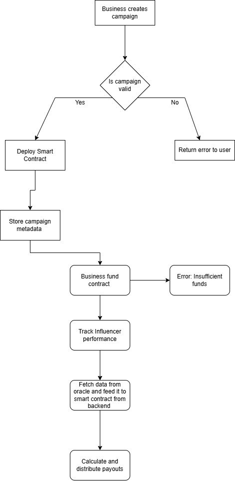

# Cryptique Influencer Payout System

This repository contains the smart contract architecture, flow diagrams, and demo video for an influencer payout automation system built during my time as an Associate Blockchain Developer at **Cryptique**.

> Note: The project was paused mid-development due to internal team changes. The architecture and smart contract testing were fully functional at the time of suspension.

---

##  Overview

The system enables businesses to:
- Create performance-based influencer marketing campaigns
- Lock campaign funds securely in smart contracts
- Automatically track influencer performance
- Distribute payouts based on verified metrics

---

##  Tech Stack

- **Smart Contracts**: Solidity (designed for ETH transactions initially)
- **Testing Environment**: Ganache + Remix
- **Frontend (planned)**: Next.js, Web3.js
- **Backend (planned)**: Node.js + Firebase
- **Blockchain (planned deployment)**: Polygon

---

##  Architecture

###  Flowchart

###  Full System Design
See [`architecture/cryptiquearch(1).pdf`](./Architecture/cryptiquearch(1).pdf)

---

##  Smart Contracts

###  CampaignFactory.sol
- Deploys new `InfluencerPayout` contracts dynamically
- Ensures each campaign is properly funded
- Stores metadata of all campaigns

###  InfluencerPayout.sol
- Accepts and holds ETH campaign funds in escrow
- Tracks influencer performance metrics (integrated via backend & oracle)
- `finalizePayout()` function distributes rewards based on predefined logic

>  Currently written and tested for **ETH transactions only**. Token support (ERC-20) was planned but not implemented before project pause.

---

##  Testing

- Contracts were deployed and tested **locally on Ganache**
- Manual testing was done via **Remix** and **Web3 scripts**
- Demo video available showing the full test cycle: deploy → fund → finalize payout

---

##  Demo Video

 [Watch the contract test demo on Google Drive](https://drive.google.com/file/d/1woeYoDzJst90V2aViv6QI8EHrVMwsbBa/view?usp=sharing)

---

## Repository Structure

